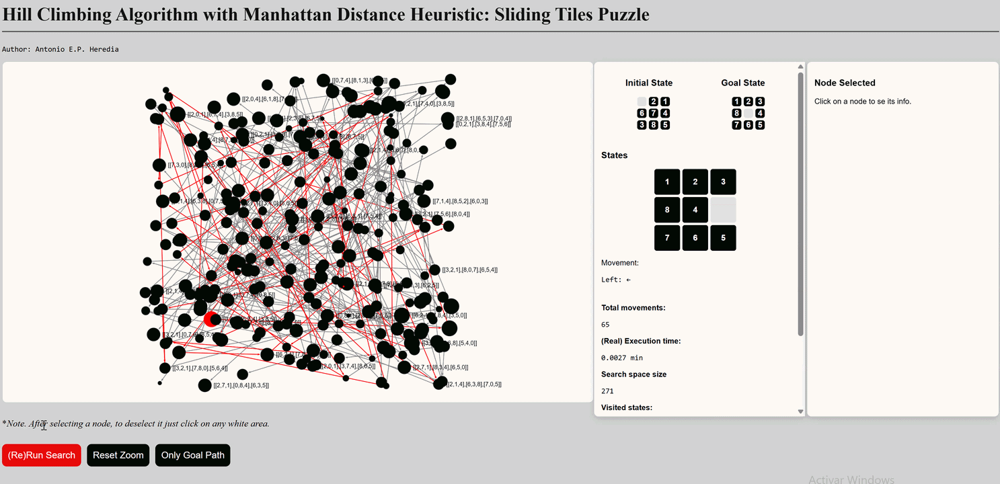

# Hill Climbing Algorithm with Manhattan Distance Heuristic: Sliding Tiles Puzzle
[](https://doi.org/10.5281/zenodo.20519117)
[](https://creativecommons.org/licenses/by-nc-nd/4.0/)


Hill climbing algorithm implemented with Typescript, mainly intended with an evaluation function using heuristic of Manhattan distance for solving nxn sliding tiles puzzles.

This is a lax implementation of the Hill Climbing algorithm, for research and study purposes

* Caution advised, comments are both in English and Spanish through all the code

## Graph visualization


*Space Search Generated with Hill Climbing: Sliding Puzzle*

Space search is shown with a graph representation of all states generated and visited during the search to reach the state goal.

## Features



* Main Panel: Shows animated graph construction each run. It can be zoomed in, navigated (pan gesture) and each node can be selected to show its data and related nodes.
    * Run Button:  Triggers Hill Climbing algorithm and shows graph generation.
    * Reset Zoom Button: Self explanatory.
    * Only Goal Path Button: Toggles visualization to only goal path or all paths.
* Middle panel: Contains information about the initial state, goal state, animation of states traversed alongside graph generation, movements made and data such as total movements, (real) execution time [^1], search space size [^2], visited states, pending states and iterations.
* Right-most panel: It shows data about the node selected, including its configuration/state, its distance to the goal, parent, movement, and if it belongs to the path that reaches the goal.

[^1]: Actual execution of hill climbing algorithm finishes at the point where graph building begins.
[^2]: Search space size consists of all states/configurations that where generated, not necessarily "visited" or inspected to continue along a path.

### Dependencies
* sigma.js: ^3.0.3
* vite:^8.0.14

### Installation
```bash
git clone https://github.com/antonioeph/hill-climbing-sliding-tiles.git
cd hill-climbing-sliding-tiles
npm install
```
### Usage
```bash
npm run dev
```
### Roadmap

#### Future
- [ ] Show only goal nodes capability.
- [ ] Parity verification (solvability).
- [ ] Support for NxN arbitrary configurations.
- [ ] UI to input any NXN initial and goal configuration.
- [ ] Code structure cleanup.
- [ ] Blog article.
- [ ] New heuristics.
- [ ] Statistical: heuristics fitness.


### Author & Contact

**[Antonio Enrique Pérez Heredia](https://antonioeph.com/cv)**
* GitHub: [@antonioeph](https://github.com/antonioeph)
* Email: antonioenriqueph@gmail.com

## Citation

If you use this software, please cite it using the following metadata:

### APA Style
Pérez Heredia, A. E. (2026). *hill-climbing-sliding-tiles* (Version 0.0.4) [Computer software]. Zenodo. https://doi.org/10.5281/zenodo.20519118

### BibTeX
```bibtex
@misc{perez_heredia_hill_climbing_2026,
  author       = {Pérez Heredia, Antonio Enrique},
  title        = {hill-climbing-sliding-tiles},
  month        = jun,
  year         = 2026,
  version      = {0.0.4},
  publisher    = {Zenodo},
  doi          = {10.5281/zenodo.20519118},
  url          = {https://github.com/antonioeph/hill-climbing-sliding-tiles}
}
```


